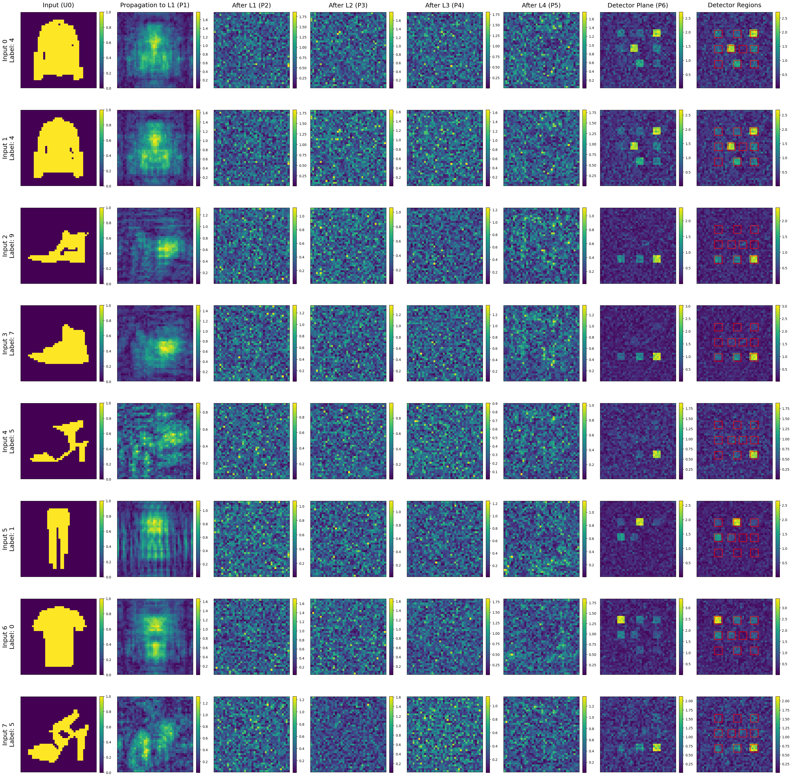

good boy 

Original code from [[GitHub Link]](https://github.com/0ce38a2b/D2NN.git)

additional reference links:
- [Solving the Diffraction Integral with the Fast Fourier Transform (FFT) and Python](https://rafael-fuente.github.io/solving-the-diffraction-integral-with-the-fast-fourier-transform-fft-and-python.html)

- [Simulating Diffraction Patterns with the Angular Spectrum Method and Python](https://rafael-fuente.github.io/simulating-diffraction-patterns-with-the-angular-spectrum-method-and-python.html)

